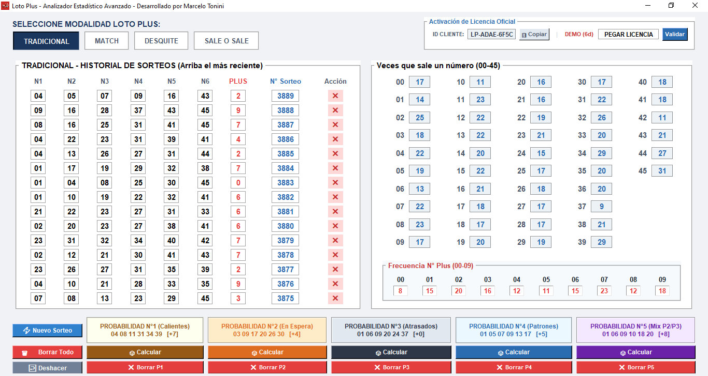

# Analizador Estadístico Avanzado - Loto Plus

Software profesional diseñado para el análisis de datos, cálculo dinámico de frecuencias y estimación de patrones probabilísticos en tiempo real para el juego Loto Plus de Argentina. Ideal tanto para agencias de lotería como para apostadores particulares que buscan profesionalizar sus jugadas.

## 📊 Vista Previa de la Interfaz

## 🚀 Características Clave
* **Cálculo de Frecuencias en Caliente:** Actualización matemática instantánea tanto de las Bolas Blancas (00-45) como del N° Plus (00-09) conforme se interactúa con la grilla.
* **Persistencia Segura de Datos:** El historial de sorteos y el estado de la licencia se resguardan de forma automatizada en la carpeta local del sistema (`AppData`), garantizando que no se pierdan datos en futuras actualizaciones o reinstalaciones.
* **Predicción Avanzada:** 5 algoritmos de cálculo probabilístico independientes para armar tus jugadas estratégicas basados en el comportamiento histórico real.

---

## 🗺️ Cobertura de Modalidades (¿Cómo funciona el juego?)

El software está diseñado para que puedas cambiar de pestaña según la modalidad que quieras analizar. Cada una guarda su propio historial independiente de números, adaptándose a las reglas oficiales del Loto Plus:

* **🔵 TRADICIONAL:** El sorteo base. Podés cargar y observar las frecuencias exactas de los 6 números principales que salen en esta primera instancia.
* **🔵 MATCH:** Una segunda oportunidad con un pozo independiente. El programa analiza este historial por separado, ya que los números que suelen salir aquí siguen sus propios patrones de frecuencia.
* **🔵 DESQUITE:** La tercera modalidad del billete. Al activar esta pestaña, la grilla se actualiza completamente con los datos históricos exclusivos del Desquite.
* **🔵 SALE O SALE:** La modalidad donde siempre hay ganadores. Ideal para buscar los números más recurrentes bajo esta regla específica de premiación.

### 🔴 ¿Qué pasa con el Número Plus?
A diferencia de los números principales, **el Número Plus (00-09) se extrae una sola vez por sorteo y es el mismo para todas las modalidades**. Por eso, el software mantiene un panel de frecuencia global para el Plus que vas a poder observar de forma constante y unificada sin importar la pestaña en la que estés parado. ¡Un análisis transparente y preciso!

---

## 🧠 ¿Cómo funcionan los 5 Algoritmos de Predicción? (P1 a P5)

Para facilitarte la jugada, el software procesa todo el historial cargado mediante 5 motores estadísticos independientes. Podés calcularlos por separado con un solo clic:

* **🔥 P1 - Probabilidad N°1 (Calientes):** Analiza la tendencia inmediata. Detecta los números que están en "racha" o mayor flujo de salida en los últimos sorteos. Ideal para seguir la inercia ganadora.
* **⏳ P2 - Probabilidad N°2 (En Espera):** Cruza la frecuencia histórica con los ciclos medios de aparición. Identifica aquellos números que están "maduros" estadísticamente y tienen una probabilidad óptima de salir.
* **📉 P3 - Probabilidad N°3 (Atrasados):** Rastrea las ausencias prolongadas. El algoritmo calcula cuáles son los números que llevan más tiempo sin aparecer en la grilla oficial para aprovechar la ley de promedio combinatorio.
* **🎯 P4 - Probabilidad N°4 (Patrones):** Analiza la composición geométrica de las combinaciones ganadoras (paridad par/impar y distribución de decenas). Genera una jugada balanceada que imita el comportamiento real del azar.
* **🔮 P5 - Probabilidad N°5 (Mix P2/P3):** El motor híbrido más avanzado. Fusiona los algoritmos de números en espera (P2) con los rezagados estructurales (P3) para ofrecerte una jugada de cobertura matemática total.

---

## 💾 Descargar Versión Demo (Prueba Gratuita por 7 días)
Podés descargar e instalar la versión de prueba funcional directamente desde este servidor seguro:

👉 **[DESCARGAR INSTALADOR DE LA DEMO](https://github.com/mtoni2/Loto-Plus/raw/main/Instalador_Loto_Plus_Avanzado.exe)**

> ⚠️ **Nota sobre la instalación:** Al ser un software independiente y no estar firmado con un certificado comercial masivo, Windows SmartScreen podría mostrar una advertencia de "Archivo no seguro" (Falso Positivo). El instalador está 100% libre de virus. Para continuar la instalación, simplemente hacé clic en **"Más información"** y luego en **"Ejecutar de todas formas"**.

---

## 🛒 Adquirir Licencia Oficial (Versión Completa)
Para desbloquear el software de forma permanente y sin límites de tiempo, podés adquirir la Licencia Oficial.

### 💰 Precio para Argentina: $49.999 ARS *(Pago Único)*

### 📋 Instrucciones para la Activación:
1. Descargá e instalá la Demo desde el enlace de arriba.
2. Abrí el programa en tu computadora.
3. En el recuadro superior derecho (**Activación de Licencia Oficial**), vas a ver tu **ID CLIENTE** único. Hacé clic en el botón **📋 Copiar**.
4. Enviame ese código por WhatsApp junto con tu comprobante de pago para que te genere tu Licencia de activación permanente.

### 💬 Contactar por WhatsApp para Comprar:
Hacé clic en el siguiente enlace para enviar el código y coordinar el pago de forma directa:

👉 **[Enviar ID Cliente por WhatsApp](https://wa.me/5492615458021?text=Hola%20Marcelo,%20quiero%20adquirir%20la%20licencia%20del%20Analizador%20Loto%20Plus%20por%20$49.999.%20Mi%20ID%20Cliente%20es:%20)**

---

🎨 **Muchas gracias por adquirir el Analizador Estadístico Avanzado del Loto Plus**